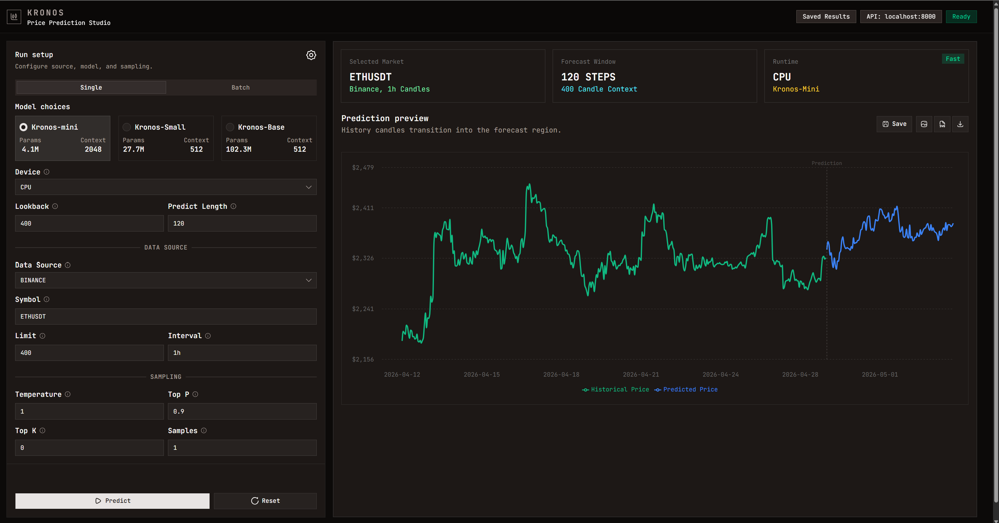
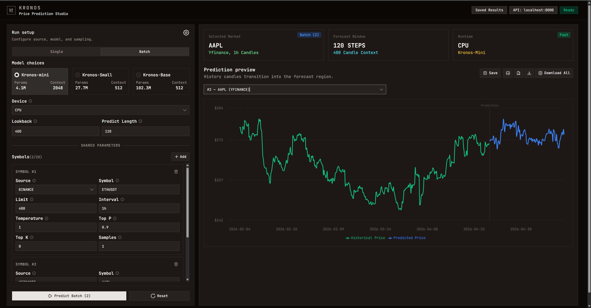
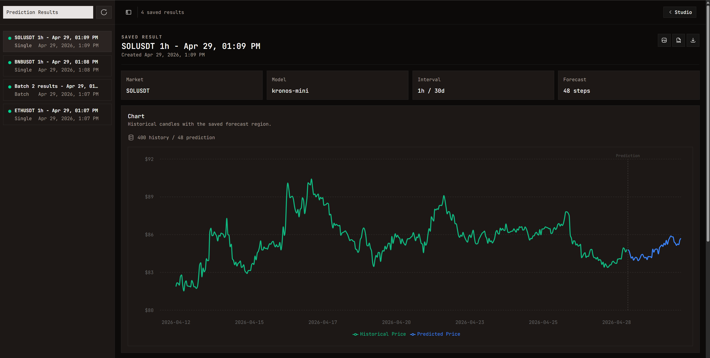

# Kronos Studio

A clean, interactive UI for testing and exploring **Kronos** the first open-source foundation model for financial candlestick (K-line) data, pre-trained on data from 45+ global exchanges.

Kronos Studio gives you a no-code interface to run Kronos models, visualize OHLCV forecasts, and manage results. If you want to quickly test what the models can do without writing any Python, this is the easiest way to do it.

> Kronos paper: [arXiv 2508.02739](https://arxiv.org/abs/2508.02739) · Accepted at **AAAI 2026** </br>
> Kronos repository: https://github.com/shiyu-coder/Kronos


## What You Can Do

- **Run price predictions** on any crypto or stock ticker using Kronos transformer models
- **Choose your data source** — Binance (crypto), yFinance (stocks), or upload your own CSV
- **Single or Batch mode** — predict one asset or many at once
- **Interactive OHLCV charts** — history transitions smoothly into the forecast region
- **Export results** — download charts as SVG/PNG or raw data as CSV
- **Save & revisit** — store prediction results in a local SQLite database and browse them later


## Screenshots

### 1. Single Prediction — ETHUSDT (Binance, 1h)

Configure your model, data source, and sampling parameters on the left. The forecast appears instantly on the right as an interactive chart showing historical candles blending into the predicted region.



### 2. Batch Prediction — Multiple Assets

Add up to 20 symbol/source combinations. Run them all at once and switch between results using the dropdown. A **Download All** button exports every chart as a ZIP.



### 3. Saved Results

All saved predictions are stored locally and accessible from the **Saved Results** page. Each entry shows the market, model, interval, and forecast length — along with a full chart replay.




## Project Structure

```
Kronos-Studio/
├── server/                   # FastAPI prediction server (Python 3.13)
│   ├── model/                # Kronos model definitions (PyTorch)
│   ├── routers/              # API route handlers
│   ├── schemas/              # Pydantic request/response models
│   ├── services/             # Business logic (prediction, data, results)
│   ├── db/                   # SQLite connection & migrations
│   ├── errors/               # Custom exception classes
│   ├── constants/            # Shared constants
│   ├── tests/                # Pytest test suite
│   └── main.py               # Application entry point
└── frontend/                 # Next.js 16 web UI (TypeScript)
    └── src/
        ├── app/              # Next.js App Router pages
        ├── components/       # Reusable React components
        ├── hooks/            # Custom React hooks
        ├── stores/           # Zustand global state
        ├── schemas/          # Zod validation schemas
        ├── lib/              # API client & utilities
        └── utils/            # Download & export helpers
```


## Prerequisites

| Tool                             | Minimum Version | Purpose                  |
| -------------------------------- | --------------- | ------------------------ |
| Python                           | **3.13+**       | Server runtime           |
| [uv](https://docs.astral.sh/uv/) | latest          | Python package manager   |
| Node.js                          | **18+**         | Frontend runtime         |
| npm                              | **9+**          | Frontend package manager |

### Install `uv` (Python package manager)

```bash
# Windows (PowerShell)
powershell -ExecutionPolicy ByPass -c "irm https://astral.sh/uv/install.ps1 | iex"

# macOS / Linux
curl -LsSf https://astral.sh/uv/install.sh | sh

# Or via pip
pip install uv
```


## Getting Started

### 1. Install dependencies

```bash
# Backend
cd server && uv sync

# Frontend
cd frontend && npm install
```

### 2. Run

Open two terminals:

```bash
# Terminal 1 — Backend
cd server
uv run uvicorn main:app --host 0.0.0.0 --port 8000 --workers 2

# Terminal 2 — Frontend
cd frontend
npm run build && npm run start
```

Then open **[http://localhost:3000](http://localhost:3000)**.


## How to Use

### Single Prediction

1. Open the app and select the **Single** tab.
2. Pick a **Kronos model** (`mini`, `small`, or `base`).
3. Choose a **data source**: Binance, yFinance, or Local CSV.
4. Enter a **ticker symbol** — e.g. `ETHUSDT`, `AAPL`, `TSLA`.
5. Set your lookback window, prediction length, and sampling parameters.
6. Click **Predict** — the chart renders history + forecast in seconds.
7. Use the toolbar to **Save**, export as **SVG/PNG**, or download raw **CSV**.

### Batch Predictions

1. Switch to the **Batch** tab.
2. Click **+ Add** to add symbol entries (up to 20).
3. Each symbol can have its own source, interval, limit, and sampling params.
4. Click **Predict Batch** — all predictions run in parallel.
5. Use the dropdown to switch between results; hit **Download All** to get a ZIP of all charts.

### Saved Results

1. After any prediction, click **Save** to store it with an optional label.
2. Navigate to **Saved Results** (top-right) to browse stored predictions.
3. Each result shows market info, model used, forecast length, and a full chart.
4. Results are stored locally in `server/db/kronos.db`.

### Local CSV Upload

Your CSV must include OHLCV columns (auto-normalized):

```
Date, Open, High, Low, Close, Volume
```

1. Select **Local** as the data source and upload your file.
2. The server stores it and returns a path this is used automatically for prediction.


## Available Kronos Models

| Model          | Params | Context Length | Best For                          |
| -------------- | ------ | -------------- | --------------------------------- |
| `kronos-mini`  | 4.1M   | 2048 tokens    | Fast inference, quick prototyping |
| `kronos-small` | 24.7M  | 512 tokens     | Balanced speed vs. accuracy       |
| `kronos-base`  | 102.3M | 512 tokens     | Best accuracy, more compute       |

> **First run:** Models download automatically from Hugging Face Hub on first use. An internet connection is required.

---

## Troubleshooting

**Model download fails**
Kronos models are pulled from Hugging Face on first use. Check your internet connection and ensure `huggingface_hub` is installed via `uv sync`.

**Frontend can't reach the API**
Confirm the backend is running on port `8000` and CORS middleware allows `*` in `server/main.py`.

**CUDA / GPU not detected**
Set `device` to `"cpu"` in the prediction request, or ensure PyTorch with CUDA support is installed and GPU drivers are up to date.


## Contributing

PRs, ideas, and discussions are welcome! Please open an issue if you have suggestions or find bugs.


## License

This project is licensed under the MIT License.
